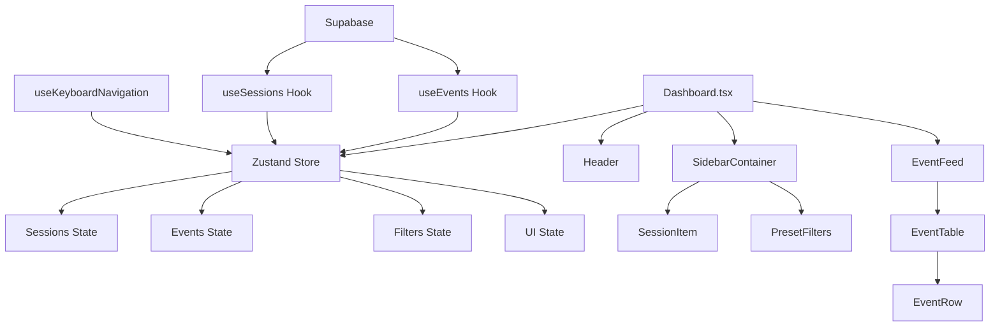

# Integration Patterns Documentation

## Overview

This document details the comprehensive integration patterns used in the Chronicle Dashboard, including component communication, keyboard navigation, real-time data flow, and state management patterns. The dashboard implements a sophisticated architecture that enables seamless interaction between different components while maintaining high performance.

## Component Communication Architecture

### High-Level Architecture



### Central State Management

The dashboard uses **Zustand** as the central state management solution with the following key patterns:

#### Store Structure (`dashboardStore.ts`)
```typescript
interface DashboardStore {
  // Data state
  sessions: SessionData[];
  events: EventData[];
  filters: FilterOptions;
  ui: UIState;
  
  // Real-time state
  realtime: RealtimeState;
  
  // Actions for data mutation
  setSessions: (sessions: SessionData[]) => void;
  setEvents: (events: EventData[]) => void;
  updateFilters: (filters: Partial<FilterOptions>) => void;
  
  // Computed selectors
  getFilteredEvents: () => EventData[];
  getFilteredSessions: () => SessionData[];
}
```

#### State Synchronization Pattern

**1. Data Flow from Supabase to Store:**
```typescript
// In Dashboard.tsx
const { events, loading: eventsLoading } = useEvents({ 
  limit: 100, 
  enableRealtime: true 
});

const { sessions, loading: sessionsLoading } = useSessions();

// Update store when data changes
useEffect(() => {
  if (events) {
    const storeEvents = events.map(e => ({
      id: e.id,
      sessionId: e.session_id,
      type: e.event_type,
      timestamp: new Date(e.timestamp),
      metadata: e.metadata || {},
      tool_name: extractToolName(e), // Custom extraction logic
      status: 'active' as const
    }));
    setEvents(storeEvents);
  }
}, [events, setEvents]);
```

**2. Cross-Component State Access:**
```typescript
// Any component can access filtered data
const { getFilteredEvents, filters } = useDashboardStore();
const filteredEvents = getFilteredEvents();

// Session selection affects event display
const handleSessionClick = (sessionId: string) => {
  toggleSessionSelection(sessionId, false); // Single selection
  // This automatically updates getFilteredEvents() result
};
```

## Keyboard Navigation System

### Architecture Overview

The keyboard navigation system is implemented through a sophisticated hook-based architecture that provides vim-style navigation and quick actions.

### Core Implementation (`useKeyboardNavigation.ts`)

#### Key Mappings
```typescript
const DEFAULT_KEY_MAPPINGS: KeyMappings = {
  nextEvent: ['j', 'ArrowDown'],
  previousEvent: ['k', 'ArrowUp'],
  toggleSidebar: ['b'], // Combined with Cmd/Ctrl
  focusSearch: ['/'],
  clearFilters: ['Escape'],
  quickFilters: {
    '1': 'active',
    '2': 'awaiting', 
    '3': 'completed'
  }
};
```

#### Navigation State Management
```typescript
interface NavigationState {
  selectedEventIndex: number;
  totalEvents: number;
  isNavigating: boolean;
  lastNavigationTime: number;
}

const navigateToEvent = useCallback((direction: 'next' | 'previous') => {
  const newIndex = direction === 'next' 
    ? Math.min(currentIndex + 1, filteredEvents.length - 1)
    : Math.max(currentIndex - 1, 0);

  const selectedEventId = filteredEvents[newIndex]?.id;
  if (selectedEventId) {
    setSelectedEvent(selectedEventId);
    
    // Smooth scroll to event
    setTimeout(() => {
      const eventElement = document.querySelector(`[data-event-id="${selectedEventId}"]`);
      eventElement?.scrollIntoView({ 
        behavior: 'smooth', 
        block: 'center' 
      });
    }, 50);
  }
}, [filteredEvents, setSelectedEvent]);
```

### Multi-Level Keyboard Handling

#### 1. Global Dashboard Shortcuts (`Dashboard.tsx`)
```typescript
const handleKeyDown = useCallback((event: KeyboardEvent) => {
  // Cmd+B or Ctrl+B to toggle sidebar
  if ((event.metaKey || event.ctrlKey) && event.key === 'b') {
    event.preventDefault();
    setSidebarCollapsed(!sidebarCollapsed);
  }
  
  // Number keys for quick filters (1, 2, 3)
  if (!event.metaKey && !event.ctrlKey && !event.altKey) {
    const store = useDashboardStore.getState();
    switch (event.key) {
      case '1':
        event.preventDefault();
        store.clearSelectedSessions();
        break;
      case '2':
        event.preventDefault();
        const activeSessions = store.sessions
          .filter(s => s.status === 'active')
          .map(s => s.id);
        store.setSelectedSessions(activeSessions);
        break;
      case '3':
        event.preventDefault();
        const awaitingSessions = store.sessions
          .filter(s => s.isAwaiting === true)
          .map(s => s.id);
        store.setSelectedSessions(awaitingSessions);
        break;
    }
  }
}, [sidebarCollapsed, setSidebarCollapsed]);
```

#### 2. Event Table Navigation (`EventTable.tsx`)
```typescript
const handleKeyDown = useCallback((e: React.KeyboardEvent) => {
  if (!listRef.current || validEvents.length === 0) return;
  
  switch (e.key) {
    case 'j':
    case 'ArrowDown':
      e.preventDefault();
      setSelectedIndex(prev => {
        const newIndex = Math.min(prev + 1, validEvents.length - 1);
        listRef.current?.scrollToItem(newIndex, 'smart');
        return newIndex;
      });
      break;
    case 'k':
    case 'ArrowUp':
      e.preventDefault();
      setSelectedIndex(prev => {
        const newIndex = Math.max(prev - 1, 0);
        listRef.current?.scrollToItem(newIndex, 'smart');
        return newIndex;
      });
      break;
    case 'g':
      if (e.shiftKey) {
        // Shift+G: Go to bottom
        const lastIndex = validEvents.length - 1;
        setSelectedIndex(lastIndex);
        listRef.current?.scrollToItem(lastIndex, 'end');
      } else {
        // gg: Go to top
        setSelectedIndex(0);
        listRef.current?.scrollToItem(0, 'start');
      }
      break;
  }
}, [validEvents.length]);
```

#### 3. Input Focus Management
```typescript
// Don't handle keys when typing in inputs (except specific cases)
const activeElement = document.activeElement;
const isInputFocused = activeElement instanceof HTMLInputElement || 
                      activeElement instanceof HTMLTextAreaElement ||
                      activeElement?.getAttribute('contenteditable') === 'true';

// Allow escape and sidebar toggle even when input is focused
const isAllowedWhenInputFocused = 
  keyMappings.clearFilters.includes(event.key) ||
  (keyMappings.toggleSidebar.includes(event.key) && (event.metaKey || event.ctrlKey));

if (isInputFocused && !isAllowedWhenInputFocused) return;
```

## Real-Time Data Flow Patterns

### Data Flow Architecture

```ascii
┌─────────────┐    ┌──────────────┐    ┌─────────────┐
│   Supabase  │───▶│  useEvents   │───▶│ EventBatcher│
│  Realtime   │    │    Hook      │    │   (100ms)   │
└─────────────┘    └──────────────┘    └─────────────┘
                                              │
                                              ▼
┌─────────────┐    ┌──────────────┐    ┌─────────────┐
│ Dashboard   │◀───│   Zustand    │◀───│ Event Batch │
│ Components  │    │    Store     │    │ Processing  │
└─────────────┘    └──────────────┘    └─────────────┘
```

### Real-Time Event Processing

#### 1. Event Subscription (`useEvents.ts`)
```typescript
const handleRealtimeEvent = useCallback((payload: { new: Event }) => {
  const newEvent: Event = payload.new;
  
  // Record connection health
  recordEventReceived();
  
  // Prevent duplicates
  if (eventIdsRef.current.has(newEvent.id)) {
    return;
  }
  eventIdsRef.current.add(newEvent.id);

  // Add to events array (newest first)
  setEvents(prev => {
    const updatedEvents = [newEvent, ...prev];
    
    // Maintain memory limit (FIFO)
    if (updatedEvents.length > REALTIME_CONFIG.MAX_CACHED_EVENTS) {
      return updatedEvents.slice(0, REALTIME_CONFIG.MAX_CACHED_EVENTS);
    }
    
    return updatedEvents;
  });
}, [recordEventReceived]);
```

#### 2. Event Batching (`EventBatcher`)
```typescript
// EventFeed.tsx - Batching configuration
const batcherRef = useRef(getEventBatcher({
  windowMs: 100,        // 100ms batching window
  maxBatchSize: 50,     // Maximum events per batch
  preserveOrder: true   // Maintain temporal ordering
}));

const handleEventBatch = useCallback((batch: EventBatch) => {
  setEvents(prevEvents => {
    const newEvents = [...prevEvents, ...batch.events];
    
    // Apply FIFO limit
    if (newEvents.length > maxEvents) {
      return newEvents.slice(-maxEvents);
    }
    
    return newEvents;
  });
}, [maxEvents]);
```

#### 3. Performance Monitoring
```typescript
const usePerformanceMonitoring = (
  events: Event[],
  onUpdate?: (metrics: PerformanceMetrics) => void
) => {
  useEffect(() => {
    const now = Date.now();
    const timeDiff = now - lastUpdateRef.current;
    const eventDiff = events.length - lastCountRef.current;

    if (timeDiff > 0 && eventDiff > 0) {
      const eventsPerSecond = (eventDiff / timeDiff) * 1000;
      
      // Estimate memory usage
      const avgEventSize = 1024; // ~1KB per event
      const memoryUsage = events.length * avgEventSize;

      const metrics = {
        totalEvents: events.length,
        eventsPerSecond,
        memoryUsage,
        lastUpdate: new Date()
      };

      onUpdate?.(metrics);
    }
  }, [events.length, onUpdate]);
};
```

## Session Filtering and Communication

### Sidebar to Event Feed Communication

#### 1. Session Selection Pattern
```typescript
// SessionItem.tsx - Click handler
const handleSessionClick = useCallback((event: React.MouseEvent) => {
  const multiSelect = event.metaKey || event.ctrlKey;
  toggleSessionSelection(session.id, multiSelect);
}, [session.id, toggleSessionSelection]);

// Store automatically updates filtered events
const getFilteredEvents = () => {
  let filtered = [...events];
  
  // Filter by selected sessions first
  if (filters.selectedSessions.length > 0) {
    filtered = filtered.filter((event) =>
      filters.selectedSessions.includes(event.sessionId)
    );
  }
  
  return filtered;
};
```

#### 2. Filter Propagation
```typescript
// Dashboard.tsx - Filter application
<EventFeedHeader
  eventCount={filters.selectedSessions.length > 0 
    ? getFilteredEvents().length 
    : events?.length || 0}
  isFiltered={filters.selectedSessions.length > 0}
/>

<EventFeed
  initialEvents={filters.selectedSessions.length > 0 
    ? getFilteredEvents()
    : events || []}
/>
```

### Session Status Determination

#### Complex Status Logic
```typescript
// Dashboard.tsx - Session status computation
const storeSessions = sessions.map(s => {
  let status: 'active' | 'idle' | 'completed' | 'error' = 'active';
  
  if (s.end_time) {
    status = 'completed';
  } else if (s.is_awaiting) {
    // Keep awaiting status separate - don't mark as idle
    status = 'active'; // Awaiting sessions are still active
  } else if (s.minutes_since_last_event && s.minutes_since_last_event > 30) {
    status = 'idle'; // Only mark idle after 30 minutes
  }
  
  return {
    id: s.id,
    status,
    // Enhanced awaiting detection
    isAwaiting: s.is_awaiting || 
                (s.last_event_type === 'notification' && !s.end_time) || 
                false,
    // ... other properties
  };
});
```

## Event Bubbling and Delegation

### Event Handling Strategy

#### 1. Conflict Prevention
```typescript
// useKeyboardNavigation.ts - Smart event handling
const handleKeyDown = useCallback((event: KeyboardEvent) => {
  // Prevent handling if already processing
  if (isHandlingKey.current) return;

  // Don't handle keys when typing in inputs (except specific cases)
  const activeElement = document.activeElement;
  const isInputFocused = activeElement instanceof HTMLInputElement || 
                        activeElement instanceof HTMLTextAreaElement;

  // Allow certain keys even when input is focused
  const isAllowedWhenInputFocused = 
    keyMappings.clearFilters.includes(event.key) ||
    (keyMappings.toggleSidebar.includes(event.key) && (event.metaKey || event.ctrlKey));

  if (isInputFocused && !isAllowedWhenInputFocused) return;

  isHandlingKey.current = true;
  
  try {
    // Handle key events...
    if (handled && fullConfig.preventDefault) {
      event.preventDefault();
      event.stopPropagation();
    }
  } finally {
    // Reset flag after delay
    setTimeout(() => {
      isHandlingKey.current = false;
    }, 10);
  }
}, [/* dependencies */]);
```

#### 2. Event Delegation Hierarchy
```typescript
// EventTable.tsx - Table-level keyboard handling
<div 
  role="table"
  tabIndex={0}
  onKeyDown={handleKeyDown} // Table-specific navigation
>
  
  // EventRow.tsx - Row-level interactions
  <EventRow
    onClick={handleRowClick}    // Row selection
    onDoubleClick={handleOpen}  // Open details
    data-event-id={event.id}    // Navigation target
  />
</div>
```

## Performance Patterns

### Virtual Scrolling Integration
```typescript
// EventTable.tsx - High-performance rendering
const renderRow = useCallback(({ index, style, data }: {
  index: number;
  style: React.CSSProperties;
  data: { events: Event[]; sessionMap: Map<string, Session> };
}) => {
  const event = data.events[index];
  const session = data.sessionMap.get(event.session_id);
  
  return (
    <EventRow
      event={event}
      session={session}
      index={index}
      style={style}
    />
  );
}, []);

// Virtual list with optimizations
<List
  ref={listRef}
  height={listHeight}
  width={width}
  itemCount={validEvents.length}
  itemSize={22} // Dense 22px rows
  itemData={{ events: validEvents, sessionMap }}
  overscanCount={3} // Render 3 extra items for smooth scrolling
/>
```

### Memory Management
```typescript
// EventFeed.tsx - FIFO event management
const handleEventBatch = useCallback((batch: EventBatch) => {
  setEvents(prevEvents => {
    const newEvents = [...prevEvents, ...batch.events];
    
    // Apply FIFO limit to prevent memory leaks
    if (newEvents.length > maxEvents) {
      return newEvents.slice(-maxEvents); // Keep newest 1000
    }
    
    return newEvents;
  });
}, [maxEvents]);
```

## Integration Best Practices

### 1. State Management
- **Single Source of Truth**: All shared state lives in Zustand store
- **Computed Values**: Use selectors for derived state (filtered events, session counts)
- **Immutable Updates**: Always create new objects/arrays when updating state
- **Persistence**: Critical UI state (sidebar collapsed) persists to localStorage

### 2. Event Handling
- **Event Delegation**: Use single handlers at higher levels when possible
- **Conflict Prevention**: Check for input focus before handling keyboard events
- **Performance**: Debounce expensive operations, use `useCallback` for handlers
- **Cleanup**: Always remove event listeners in component cleanup

### 3. Real-Time Integration
- **Batching**: Use 100ms windows to reduce UI thrash
- **Deduplication**: Track event IDs to prevent duplicate processing
- **Memory Limits**: Implement FIFO queues with reasonable size limits
- **Connection Health**: Monitor and recover from connection failures

### 4. Component Communication
- **Props Down**: Pass data and callbacks down through props when possible
- **Events Up**: Use callbacks to notify parent components of changes
- **Global State**: Use store for truly shared state across distant components
- **Performance**: Use `React.memo` and `useMemo` to prevent unnecessary renders

## Common Integration Patterns

### Pattern 1: Filter Propagation
```typescript
// 1. User clicks session in sidebar
const handleSessionClick = () => {
  toggleSessionSelection(sessionId, multiSelect);
};

// 2. Store state updates automatically
const toggleSessionSelection = (sessionId, multiSelect) => {
  // Update selectedSessions array in store
};

// 3. Event feed re-renders with filtered data
const filteredEvents = getFilteredEvents(); // Computed selector
```

### Pattern 2: Keyboard Navigation Chain
```typescript
// 1. Global shortcut captured in Dashboard
document.addEventListener('keydown', handleGlobalShortcuts);

// 2. Navigation-specific handling in useKeyboardNavigation
const navigateToEvent = (direction) => {
  setSelectedEvent(eventId);
  scrollToEvent(eventId);
};

// 3. Visual feedback in EventRow
const isSelected = selectedEvent === event.id;
```

### Pattern 3: Real-Time Update Flow
```typescript
// 1. Supabase real-time event
supabase.channel('events').on('INSERT', handleRealtimeEvent);

// 2. Batch processing
const handleRealtimeEvent = (payload) => {
  eventBatcher.addEvent(payload.new);
};

// 3. UI update
const handleEventBatch = (batch) => {
  setEvents(prev => [...prev, ...batch.events]);
};
```

This integration architecture enables a highly responsive and performant dashboard that can handle real-time data updates while providing sophisticated user interactions through keyboard navigation and filtering systems.