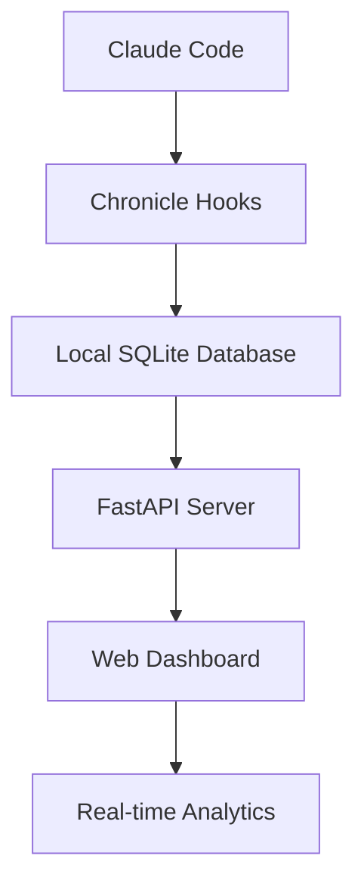

# Chronicle Documentation

Welcome to **Chronicle** - the comprehensive observability and monitoring solution for Claude Code development workflows. Chronicle provides real-time insights into your AI-assisted coding sessions, tool usage patterns, and development productivity.

## What is Chronicle?

Chronicle is a self-contained observability system that automatically captures, analyzes, and visualizes your Claude Code interactions. It runs entirely on your local machine with zero external dependencies, ensuring your code and data remain private and secure.

### Key Features

- **🔍 Real-time Monitoring** - Live dashboard showing Claude Code activity as it happens
- **💾 Local Storage** - SQLite database keeps all data on your machine
- **📊 Analytics Dashboard** - Beautiful web interface with session insights and tool usage patterns  
- **🎯 Zero Configuration** - Works out of the box with sensible defaults
- **🔌 Extensible Hooks** - Python-based hook system for custom event capture
- **🚀 High Performance** - Optimized for minimal overhead and fast response times
- **🔒 Privacy First** - All data stays local with built-in sanitization features

### Architecture Overview

Chronicle consists of three main components working together:



- **Chronicle Hooks** - Python scripts that capture Claude Code events
- **SQLite Database** - Local storage for all session and event data
- **FastAPI Server** - REST API and WebSocket server for real-time updates
- **Web Dashboard** - React/Next.js interface for data visualization

## Quick Start

Get Chronicle running in under 5 minutes:

### 1. Installation

=== "Automated Installation"

    ```bash
    # Clone and install with one command
    git clone https://github.com/your-org/chronicle.git
    cd chronicle
    python install.py
    ```

=== "Manual Installation"

    ```bash
    # Install dependencies
    cd apps/dashboard && npm install
    cd ../hooks && pip install -r requirements.txt
    
    # Start services
    python install.py --setup-only
    ```

### 2. Access Dashboard

Open your browser to [http://localhost:3000](http://localhost:3000) to see the Chronicle dashboard.

### 3. Start Using

Begin using Claude Code normally - Chronicle will automatically capture and display your activities in real-time!

## Documentation Sections

### For New Users

Start here if you're new to Chronicle:

- **[Installation Guide](getting-started/installation.md)** - Complete setup instructions
- **[Quick Start](getting-started/quick-start.md)** - Get running in 5 minutes  
- **[First Session](getting-started/first-session.md)** - Understanding the interface

### For Daily Users

Essential guides for regular Chronicle usage:

- **[Dashboard Overview](user-guide/dashboard-overview.md)** - Comprehensive interface guide
- **[Session Management](user-guide/session-management.md)** - Working with coding sessions
- **[Event Filtering](user-guide/filtering-events.md)** - Finding specific activities
- **[Configuration](user-guide/configuration.md)** - Customizing Chronicle behavior

### For Teams and Deployments

Advanced setup and team collaboration:

- **[Local Setup Tutorial](tutorials/local-setup.md)** - Detailed local installation
- **[Team Deployment](tutorials/team-deployment.md)** - Multi-user setups
- **[Advanced Configuration](tutorials/advanced-configuration.md)** - Power user features
- **[Migration Guide](tutorials/migration-from-supabase.md)** - Database migration options

### For Administrators

System management and maintenance:

- **[Server Management](admin-guide/server-management.md)** - Running and monitoring Chronicle
- **[Performance Tuning](admin-guide/performance-tuning.md)** - Optimization strategies
- **[Backup & Restore](admin-guide/backup-restore.md)** - Data protection procedures
- **[Troubleshooting](admin-guide/troubleshooting.md)** - Common issues and solutions

### For Developers

Technical implementation details:

- **[Architecture Guide](developer-guide/architecture.md)** - System design and components
- **[API Reference](developer-guide/api-reference.md)** - REST API documentation
- **[Plugin Development](developer-guide/plugin-development.md)** - Creating custom hooks
- **[Contributing Guide](developer-guide/contributing.md)** - Development workflow

### Technical Reference

Complete technical documentation:

- **[Configuration Reference](reference/configuration.md)** - All configuration options
- **[API Documentation](reference/api.md)** - Endpoint details and examples
- **[Database Schema](reference/database.md)** - SQLite table structures
- **[Hook System](reference/hooks.md)** - Event capture architecture
- **[Environment Variables](reference/environment-variables.md)** - Configuration settings

## Use Cases

### Development Analytics
- Track which tools you use most frequently
- Analyze coding session patterns and productivity
- Identify common workflows and automation opportunities
- Monitor project-specific development activities

### Learning and Training  
- Review successful problem-solving approaches
- Understand tool usage patterns for skill development
- Create documentation from actual coding sessions
- Share effective workflow patterns with team members

### Debugging and Troubleshooting
- Trace tool execution sequences during problem-solving
- Identify performance bottlenecks in development workflows
- Review error patterns and resolution strategies
- Monitor system health and resource usage

### Team Collaboration
- Share session data and insights with team members
- Compare different approaches to similar problems
- Standardize development workflows and best practices
- Track team productivity and tool usage trends

## System Requirements

### Minimum Requirements
- **Python 3.8+** for hooks system
- **Node.js 18+** for dashboard
- **512MB RAM** available
- **100MB storage** for installation + data

### Recommended Setup
- **Python 3.11+** for best performance
- **Node.js 20 LTS** for stability
- **1GB RAM** for smooth operation
- **1GB storage** for extensive session history

### Platform Support
- ✅ **macOS** (Intel and Apple Silicon)
- ✅ **Linux** (Ubuntu, Debian, RHEL, etc.)
- ✅ **Windows** (native or WSL2)

## Getting Help

### Documentation
- Browse the comprehensive guides in the sidebar
- Check the [troubleshooting guide](admin-guide/troubleshooting.md) for common issues
- Review the [FAQ section](guides/troubleshooting.md#common-questions)

### Community Support
- Report issues on [GitHub Issues](https://github.com/your-org/chronicle/issues)
- Join discussions in [GitHub Discussions](https://github.com/your-org/chronicle/discussions)
- Check existing solutions in the issue tracker

### Health Monitoring
Chronicle includes built-in health monitoring:

```bash
# Check system status
curl http://localhost:8510/health

# Run diagnostic scripts
./scripts/health-check.sh
```

## Security and Privacy

Chronicle prioritizes your privacy and security:

### Data Protection
- **Local Storage**: All data remains on your machine
- **No Cloud Dependencies**: Works completely offline
- **Data Sanitization**: Built-in PII filtering and content scrubbing
- **Configurable Retention**: Automatic cleanup of old data

### Security Features
- **Localhost Only**: Server binds to 127.0.0.1 by default
- **Process Isolation**: Runs with minimal system permissions
- **Input Validation**: Comprehensive request validation and sanitization
- **Audit Logging**: Complete activity logs for security monitoring

See the [Security Guide](guides/security.md) for detailed security information.

## What's Next?

### New to Chronicle?
1. **[Install Chronicle](getting-started/installation.md)** with the one-command installer
2. **[Complete the quick start](getting-started/quick-start.md)** to verify your setup
3. **[Take your first session tour](getting-started/first-session.md)** to learn the interface

### Already Using Chronicle?
- **[Explore advanced configuration](tutorials/advanced-configuration.md)** for power user features
- **[Set up team deployment](tutorials/team-deployment.md)** for collaborative development
- **[Learn the API](developer-guide/api-reference.md)** for programmatic access

### Want to Contribute?
- **[Read the architecture guide](developer-guide/architecture.md)** to understand the system design
- **[Review the contributing guide](developer-guide/contributing.md)** for development workflows
- **[Check open issues](https://github.com/your-org/chronicle/issues)** for ways to help

---

**Chronicle** empowers developers with comprehensive visibility into their AI-assisted coding workflows. Start monitoring your development productivity today!

<div class="grid cards" markdown>

-   :material-lightning-bolt:{ .lg .middle } **Quick Start**

    ---

    Get Chronicle running in under 5 minutes with our automated installer.

    [:octicons-arrow-right-24: Installation Guide](getting-started/installation.md)

-   :material-chart-line:{ .lg .middle } **Dashboard Tour**

    ---

    Learn the powerful analytics and monitoring features.

    [:octicons-arrow-right-24: Dashboard Overview](user-guide/dashboard-overview.md)

-   :material-api:{ .lg .middle } **API Reference**

    ---

    Complete REST API documentation for programmatic access.

    [:octicons-arrow-right-24: API Documentation](developer-guide/api-reference.md)

-   :material-help-circle:{ .lg .middle } **Need Help?**

    ---

    Troubleshooting guides and community support resources.

    [:octicons-arrow-right-24: Get Support](admin-guide/troubleshooting.md)

</div>