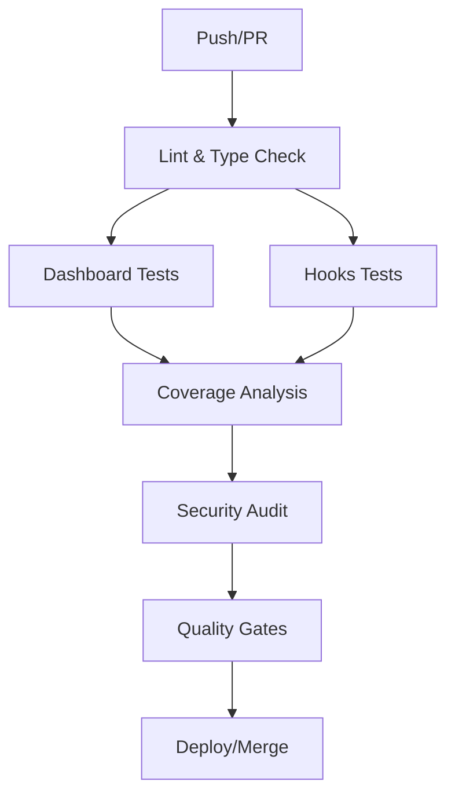

# 🔄 CI/CD Reference

Comprehensive reference for Chronicle's CI/CD pipeline, coverage enforcement, and automation.

## 📋 Pipeline Overview

Chronicle uses GitHub Actions for continuous integration and deployment with the following workflow:



## 🔧 Workflow Configuration

### Main Workflow: `.github/workflows/ci.yml`

| Job | Purpose | Runtime | Coverage Threshold |
|-----|---------|---------|-------------------|
| `dashboard-tests` | Next.js/Jest testing | ~2-3 min | 80% lines |
| `hooks-tests` | Python/pytest testing | ~1-2 min | 60% lines |
| `coverage-analysis` | Combined reporting | ~1 min | N/A |
| `quality-gates` | Security & validation | ~1 min | N/A |

### Trigger Events

```yaml
on:
  push:
    branches: [ main, dev ]
  pull_request:
    branches: [ main, dev ]
  workflow_dispatch:  # Manual trigger
```

## 📊 Coverage Enforcement

### Threshold Configuration

| Component | Lines | Functions | Branches | Statements |
|-----------|-------|-----------|----------|------------|
| **Dashboard Global** | 80% | 80% | 80% | 80% |
| **Dashboard Components** | 85% | 85% | 80% | 85% |
| **Dashboard Hooks** | 90% | 90% | 85% | 90% |
| **Dashboard Libs** | 85% | 85% | 80% | 85% |
| **Hooks Global** | 60% | 60% | 60% | 60% |

### Enforcement Points

1. **Local Development**: Optional coverage collection
2. **CI Pipeline**: Mandatory coverage enforcement
3. **PR Validation**: Automatic threshold checking
4. **Merge Blocking**: PRs fail if below thresholds

## 🛠️ Scripts & Commands

### Root Level Commands

```bash
# Full pipeline simulation
npm run validate

# Coverage workflow
npm run test:coverage        # Run all tests with coverage
npm run coverage:check       # Validate thresholds
npm run coverage:report      # Generate HTML/JSON reports
npm run coverage:badges      # Update SVG badges
npm run coverage:trend       # Track coverage over time

# CI simulation
npm run ci:test             # Run tests as CI does
npm run ci:validate         # Full validation pipeline
```

### Dashboard Commands

```bash
cd apps/dashboard

# Development
npm run dev                 # Start dev server
npm run test               # Run tests
npm run test:watch         # Watch mode

# CI/Coverage
npm run test -- --coverage --watchAll=false
npm run build              # Production build
npm run lint               # ESLint validation
```

### Hooks Commands

```bash
cd apps/hooks

# Development
uv run python -m pytest tests/  # Run tests
uv run pytest --watch          # Watch mode (if configured)

# CI/Coverage
uv run pytest --cov=src --cov-fail-under=60
uv run flake8 src tests        # Linting
uv run mypy src                # Type checking
```

## 📈 Coverage Reporting

### Report Formats

| Format | Location | Purpose |
|--------|----------|---------|
| **JSON** | `coverage-report.json` | Machine readable |
| **HTML** | `coverage-report.html` | Human readable |
| **LCOV** | `apps/*/coverage.lcov` | Codecov integration |
| **Trends** | `coverage-trends.json` | Historical tracking |

### Generated Artifacts

```
📁 Chronicle Root
├── 📄 coverage-report.json          # Combined coverage data
├── 📄 coverage-report.html          # Visual coverage report  
├── 📄 coverage-trends.json          # Historical data
├── 📄 coverage-trends-report.md     # Trend analysis
└── 📁 badges/                       # SVG badges
    ├── dashboard-coverage.svg
    ├── hooks-coverage.svg
    ├── overall-coverage.svg
    └── coverage-status.svg

📁 apps/dashboard/
└── 📁 coverage/                     # Jest coverage output
    ├── coverage-summary.json
    ├── lcov.info
    └── 📁 lcov-report/              # HTML report

📁 apps/hooks/
├── 📄 coverage.json                # pytest-cov JSON
├── 📄 coverage.lcov                # LCOV format
└── 📁 htmlcov/                     # HTML report
```

## 🔐 Security & Quality

### Security Audits

```bash
# Dashboard (npm audit)
npm audit --audit-level=moderate

# Hooks (safety check)
cd apps/hooks
uv run safety check
```

### Quality Gates

1. **Linting**: ESLint (dashboard) + flake8 (hooks)
2. **Type Checking**: TypeScript + mypy
3. **Security**: npm audit + safety
4. **Coverage**: Threshold enforcement
5. **Build**: Production build verification

## 🚨 Failure Scenarios & Debugging

### Common CI Failures

#### Coverage Below Threshold

```bash
# Error Example
❌ Dashboard coverage (78.5%) is below required 80% threshold

# Debug Locally
npm run test:coverage:dashboard
# Review: apps/dashboard/coverage/lcov-report/index.html

# Fix: Add tests for uncovered lines
```

#### Hooks Coverage Failure

```bash
# Error Example  
❌ Hooks coverage (58.2%) is below required 60% threshold

# Debug Locally
cd apps/hooks
uv run pytest --cov=src --cov-report=html
# Review: htmlcov/index.html

# Fix: Add tests for uncovered modules
```

#### Security Audit Failures

```bash
# Dashboard - High/Critical vulnerabilities
npm audit fix

# Hooks - Unsafe dependencies
uv add <safe-alternative>
```

### Debugging Workflow

1. **Check CI Logs**: Review GitHub Actions output
2. **Reproduce Locally**: Run same commands locally
3. **Isolate Issue**: Test specific components
4. **Fix & Verify**: Make changes and re-test
5. **Push Update**: Trigger CI re-run

## 📊 Monitoring & Alerts

### Coverage Trends

The system automatically tracks:

- **Daily Coverage**: Per-commit coverage data
- **Trend Analysis**: Improving/declining/stable
- **Regression Detection**: Significant drops
- **Recommendations**: Automated improvement suggestions

### PR Comments

Automatic coverage reports on PRs:

```markdown
## 📊 Coverage Report

| Component | Coverage | Threshold | Status |
|-----------|----------|-----------|--------|
| 📊 Dashboard | 82.1% | 80% | ✅ |
| 🪝 Hooks | 64.3% | 60% | ✅ |

🎉 All coverage thresholds met!
```

## 🔧 Customization

### Adding New Thresholds

#### Dashboard (Jest)

Edit `apps/dashboard/jest.config.js`:

```javascript
coverageThreshold: {
  'src/new-module/**/*.ts': {
    lines: 90,
    functions: 90,
  }
}
```

#### Hooks (pytest)

Edit `apps/hooks/pyproject.toml`:

```toml
[tool.pytest.ini_options]
addopts = ["--cov-fail-under=70"]  # Increase threshold
```

### Custom Scripts

Add to root `package.json`:

```json
{
  "scripts": {
    "coverage:custom": "node scripts/coverage/custom-analysis.js"
  }
}
```

## 📋 Maintenance Checklist

### Weekly

- [ ] Review coverage trends
- [ ] Check for security vulnerabilities
- [ ] Validate CI performance
- [ ] Update dependencies if needed

### Monthly

- [ ] Analyze coverage patterns
- [ ] Review and adjust thresholds
- [ ] Update documentation
- [ ] Performance optimization

### Release

- [ ] Full coverage validation
- [ ] Security audit
- [ ] Integration test run
- [ ] Production build verification

## 🔗 External Integrations

### Codecov

Coverage reports are uploaded to Codecov:

```yaml
- name: Upload coverage to Codecov
  uses: codecov/codecov-action@v4
  with:
    flags: dashboard,hooks
    fail_ci_if_error: true
```

### Badge Integration

Include badges in README:

```markdown


```

## 📚 Resources

- [GitHub Actions Documentation](https://docs.github.com/en/actions)
- [Jest Coverage Configuration](https://jestjs.io/docs/configuration#coverage)
- [pytest-cov Documentation](https://pytest-cov.readthedocs.io/)
- [Codecov Integration](https://docs.codecov.com/docs)

---

*This reference is automatically updated when CI/CD configurations change.*