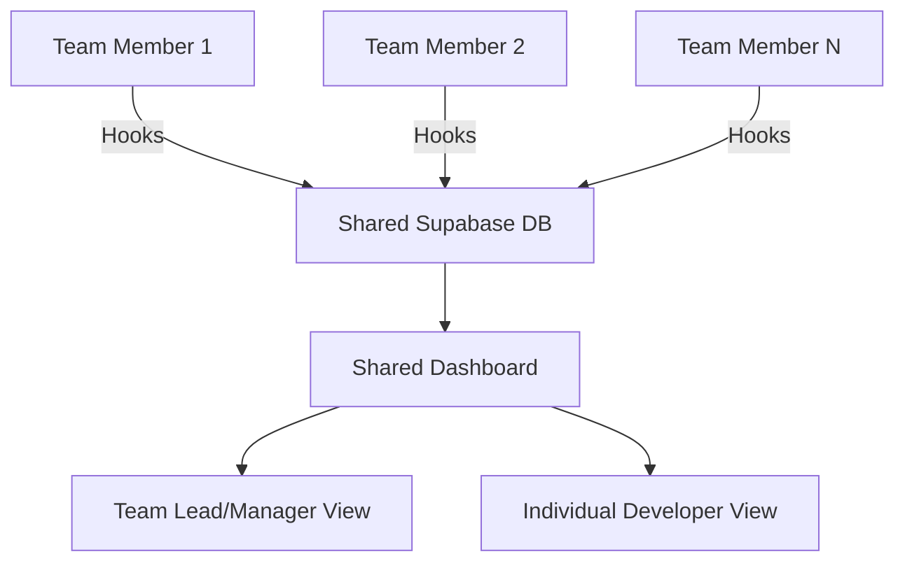
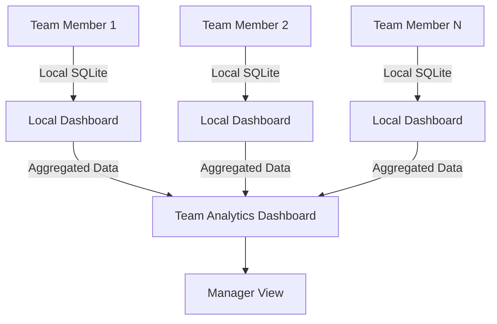
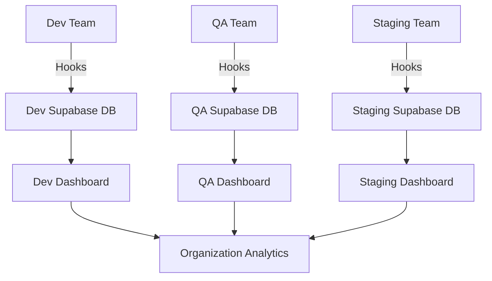

# Team Deployment Guide - Chronicle

> **Complete guide for deploying Chronicle in team environments with shared dashboards, centralized data collection, and collaboration features**

## Overview

This tutorial covers deploying Chronicle for teams, from small development groups to large engineering organizations. Learn how to set up shared dashboards, centralized data collection, and team collaboration features while maintaining security and performance.

**What you'll accomplish:**
- ✅ Understand team deployment architecture options
- ✅ Set up centralized Supabase backend for shared data
- ✅ Configure team member access and permissions  
- ✅ Deploy shared dashboards for team visibility
- ✅ Implement security and privacy controls
- ✅ Set up monitoring and maintenance procedures

**Time Required**: 45-90 minutes (depending on team size and deployment complexity)

## Team Deployment Architecture Options

### Option 1: Centralized Shared Backend

**Best for**: Small to medium teams (2-20 developers) who want shared visibility



**Characteristics:**
- Single Supabase database for all team data
- Shared dashboard with team-wide visibility  
- Individual filtering by team member
- Centralized monitoring and analytics
- **Security**: Row-level security, role-based access

### Option 2: Distributed with Data Aggregation

**Best for**: Large teams (20+ developers) or teams with privacy requirements



**Characteristics:**
- Individual local SQLite databases
- Privacy-first: sensitive data stays local
- Aggregated metrics sent to team dashboard
- **Security**: Individual control over data sharing

### Option 3: Hybrid Multi-Environment

**Best for**: Organizations with multiple teams/projects requiring segregation



**Characteristics:**
- Environment-separated databases
- Team-specific dashboards
- Organization-level analytics aggregation
- **Security**: Environment isolation, least-privilege access

## Decision Tree: Choosing Your Architecture

```bash
# Use this decision tree to select the right approach:

Team Size <= 10 people?
├── Yes: Centralized Shared Backend (Option 1)
│   └── Privacy concerns about code data?
│       ├── Yes: Consider Distributed (Option 2) 
│       └── No: Centralized is perfect
│
└── No: Team Size > 10
    ├── Multiple teams/projects?
    │   ├── Yes: Hybrid Multi-Environment (Option 3)
    │   └── No: Distributed with Aggregation (Option 2)
    │
    └── Compliance requirements (GDPR, HIPAA, etc.)?
        └── Yes: Distributed (Option 2) recommended
```

## Prerequisites and Planning

### System Requirements (Team Lead/Admin)

**Required Tools:**
- **Supabase Account**: Team or Pro plan recommended
- **Domain & SSL**: For production dashboard deployment
- **CI/CD Pipeline**: GitHub Actions, GitLab CI, or similar
- **Monitoring**: Sentry, DataDog, or similar APM tool

**Team Member Requirements:**
- **Node.js**: 18.0.0+ (same as individual setup)
- **Python**: 3.8.0+ (same as individual setup)  
- **Claude Code**: Latest version
- **Network Access**: To team Supabase instance

### Team Planning Checklist

Before deployment, decide on:

- [ ] **Data Sharing Level**: What data should be shared vs. kept private?
- [ ] **Access Control**: Who can see which team members' data?
- [ ] **Retention Policies**: How long to keep session data?
- [ ] **Security Requirements**: Compliance, audit trails, data sanitization
- [ ] **Deployment Method**: Cloud hosting vs. self-hosted
- [ ] **Backup Strategy**: Data backup and disaster recovery
- [ ] **Team Onboarding**: How to add/remove team members

## Option 1: Centralized Shared Backend Setup

### Step 1: Team Supabase Setup

#### Create Team Supabase Project

1. **Create Organization Supabase Project**:
   ```bash
   # Visit https://supabase.com/dashboard
   # Create new project: "chronicle-team-[yourteam]"
   # Choose a region close to your team
   # Save the project URL and keys
   ```

2. **Configure Database Schema**:
   ```sql
   -- Enhanced schema with team support
   -- Run this in Supabase SQL Editor
   
   -- Enable RLS (Row Level Security)
   ALTER TABLE chronicle_sessions ENABLE ROW LEVEL SECURITY;
   ALTER TABLE chronicle_events ENABLE ROW LEVEL SECURITY;
   
   -- Add team/user identification
   ALTER TABLE chronicle_sessions 
   ADD COLUMN user_id TEXT,
   ADD COLUMN team_id TEXT DEFAULT 'default-team';
   
   ALTER TABLE chronicle_events
   ADD COLUMN user_id TEXT;
   
   -- Create user profiles table
   CREATE TABLE chronicle_users (
       id UUID PRIMARY KEY DEFAULT gen_random_uuid(),
       claude_user_id TEXT UNIQUE NOT NULL,
       display_name TEXT NOT NULL,
       email TEXT,
       team_id TEXT DEFAULT 'default-team',
       role TEXT DEFAULT 'developer' CHECK (role IN ('admin', 'lead', 'developer', 'viewer')),
       data_sharing_level TEXT DEFAULT 'team' CHECK (data_sharing_level IN ('private', 'team', 'public')),
       created_at TIMESTAMPTZ DEFAULT NOW(),
       last_active TIMESTAMPTZ DEFAULT NOW()
   );
   
   -- RLS Policies
   CREATE POLICY "Users can see team sessions" ON chronicle_sessions
     FOR SELECT USING (team_id = (SELECT team_id FROM chronicle_users WHERE claude_user_id = auth.uid()::text));
   
   CREATE POLICY "Users can insert own sessions" ON chronicle_sessions
     FOR INSERT WITH CHECK (user_id = auth.uid()::text);
   
   CREATE POLICY "Users can see team events" ON chronicle_events
     FOR SELECT USING (
       session_id IN (
         SELECT id FROM chronicle_sessions 
         WHERE team_id = (SELECT team_id FROM chronicle_users WHERE claude_user_id = auth.uid()::text)
       )
     );
   
   -- Create indexes for team queries
   CREATE INDEX idx_sessions_team_user ON chronicle_sessions(team_id, user_id);
   CREATE INDEX idx_users_team ON chronicle_users(team_id);
   ```

#### Setup Team Environment Variables

3. **Create Team Environment Configuration**:
   ```bash
   # Create shared environment config
   # Store this in your team's secure config management (1Password, AWS Secrets, etc.)
   
   # team-config.env (DO NOT COMMIT TO GIT)
   CHRONICLE_ENVIRONMENT=team-production
   CHRONICLE_TEAM_ID=your-team-name
   CHRONICLE_SUPABASE_URL=https://your-team-project.supabase.co
   CHRONICLE_SUPABASE_ANON_KEY=your-team-anon-key
   CHRONICLE_SUPABASE_SERVICE_ROLE_KEY=your-team-service-role-key
   
   # Dashboard configuration  
   NEXT_PUBLIC_SUPABASE_URL=https://your-team-project.supabase.co
   NEXT_PUBLIC_SUPABASE_ANON_KEY=your-team-anon-key
   NEXT_PUBLIC_TEAM_ID=your-team-name
   NEXT_PUBLIC_TEAM_MODE=true
   
   # Security settings for teams
   NEXT_PUBLIC_ENABLE_USER_FILTERING=true
   NEXT_PUBLIC_ENABLE_PRIVACY_CONTROLS=true
   NEXT_PUBLIC_DEFAULT_DATA_SHARING=team
   ```

### Step 2: Deploy Team Dashboard

#### Option A: Vercel Team Deployment (Recommended)

```bash
# Clone and configure for team deployment
git clone https://github.com/your-org/chronicle.git chronicle-team
cd chronicle-team/apps/dashboard

# Install dependencies
npm install

# Configure for team deployment
cp .env.example .env.local
# Add team configuration from step 3

# Deploy to Vercel
npx vercel --prod

# Set environment variables in Vercel dashboard
# Go to: https://vercel.com/your-team/chronicle-team/settings/environment-variables
```

#### Option B: Self-Hosted Team Deployment

```bash
# On your team server
git clone https://github.com/your-org/chronicle.git /opt/chronicle
cd /opt/chronicle/apps/dashboard

# Install dependencies
npm ci --production
npm run build

# Set up systemd service
sudo tee /etc/systemd/system/chronicle-team.service << EOF
[Unit]
Description=Chronicle Team Dashboard
After=network.target

[Service]
Type=simple
User=chronicle
WorkingDirectory=/opt/chronicle/apps/dashboard
Environment=NODE_ENV=production
Environment=PORT=3000
EnvironmentFile=/opt/chronicle/team-config.env
ExecStart=/usr/bin/npm start
Restart=on-failure
RestartSec=10

[Install]
WantedBy=multi-user.target
EOF

# Enable and start service
sudo systemctl enable chronicle-team
sudo systemctl start chronicle-team

# Setup reverse proxy (nginx)
sudo tee /etc/nginx/sites-available/chronicle-team << EOF
server {
    listen 443 ssl http2;
    server_name chronicle.yourteam.com;
    
    ssl_certificate /etc/letsencrypt/live/chronicle.yourteam.com/fullchain.pem;
    ssl_certificate_key /etc/letsencrypt/live/chronicle.yourteam.com/privkey.pem;
    
    location / {
        proxy_pass http://localhost:3000;
        proxy_http_version 1.1;
        proxy_set_header Upgrade \$http_upgrade;
        proxy_set_header Connection 'upgrade';
        proxy_set_header Host \$host;
        proxy_set_header X-Real-IP \$remote_addr;
        proxy_set_header X-Forwarded-For \$proxy_add_x_forwarded_for;
        proxy_set_header X-Forwarded-Proto \$scheme;
        proxy_cache_bypass \$http_upgrade;
    }
}
EOF

sudo ln -s /etc/nginx/sites-available/chronicle-team /etc/nginx/sites-enabled/
sudo nginx -t && sudo systemctl reload nginx
```

### Step 3: Team Member Onboarding

#### Create Team Installation Script

```bash
# team-install.sh - Share this with team members
#!/bin/bash

set -e

echo "🚀 Setting up Chronicle for Team: YOUR_TEAM_NAME"

# Check prerequisites
if ! command -v node &> /dev/null; then
    echo "❌ Node.js not found. Please install Node.js 18+"
    exit 1
fi

if ! command -v python3 &> /dev/null; then
    echo "❌ Python not found. Please install Python 3.8+"
    exit 1
fi

# Get team member info
echo "👤 Team member setup:"
read -p "Your name/identifier: " USER_NAME
read -p "Your email (optional): " USER_EMAIL

# Clone and configure
git clone https://github.com/your-org/chronicle.git ~/chronicle-team
cd ~/chronicle-team/apps/hooks

# Install Python dependencies
pip install -r requirements.txt

# Configure hooks for team
cp .env.template .env
cat << EOF >> .env
# Team Configuration
CHRONICLE_ENVIRONMENT=team-production
CHRONICLE_TEAM_ID=YOUR_TEAM_NAME
CHRONICLE_USER_ID=${USER_NAME}
CHRONICLE_USER_EMAIL=${USER_EMAIL}

# Team Supabase Connection
SUPABASE_URL=https://your-team-project.supabase.co
SUPABASE_ANON_KEY=your-team-anon-key
SUPABASE_SERVICE_ROLE_KEY=your-team-service-role-key

# Privacy Settings
CLAUDE_HOOKS_SANITIZE_DATA=true
CLAUDE_HOOKS_PII_FILTERING=true
CLAUDE_HOOKS_DATA_SHARING_LEVEL=team
EOF

# Install hooks
python scripts/install.py --team-mode

echo "✅ Chronicle team setup complete!"
echo "📊 Team Dashboard: https://chronicle.yourteam.com"
echo "🔧 Your hooks are now sending data to the team database"
```

#### Team Member Registration

```bash
# Add team member to database (run by team admin)
cd apps/hooks
python -c "
from src.database import DatabaseManager
dm = DatabaseManager()

# Register new team member
user_data = {
    'claude_user_id': 'member-unique-id',
    'display_name': 'Team Member Name',
    'email': 'member@yourteam.com',
    'team_id': 'your-team-name',
    'role': 'developer',
    'data_sharing_level': 'team'
}

dm.register_user(user_data)
print('✅ Team member registered successfully')
"
```

### Step 4: Team Dashboard Features

#### Enable Team-Specific Features

Add to your dashboard environment:

```env
# apps/dashboard/.env.local
NEXT_PUBLIC_TEAM_MODE=true
NEXT_PUBLIC_TEAM_FEATURES=user-filtering,privacy-controls,team-analytics
NEXT_PUBLIC_DEFAULT_VIEW=team-overview
```

#### Team Dashboard Components

The team dashboard automatically includes:

1. **Team Overview**: Sessions and activity across all team members
2. **User Filtering**: Filter by individual team member  
3. **Team Analytics**: Productivity metrics, tool usage patterns
4. **Privacy Controls**: Individual data sharing preferences
5. **Activity Heatmaps**: Team activity patterns over time

### Step 5: Team Management

#### User Management Commands

```bash
# Admin utilities for team management
cd apps/hooks

# List team members
python -c "
from src.database import DatabaseManager
dm = DatabaseManager()
users = dm.get_team_users('your-team-name')
for user in users:
    print(f'{user[\"display_name\"]} ({user[\"role\"]}) - {user[\"last_active\"]}')
"

# Update user permissions
python -c "
from src.database import DatabaseManager
dm = DatabaseManager()
dm.update_user_role('member-id', 'lead')
print('✅ User role updated')
"

# Remove team member
python -c "
from src.database import DatabaseManager
dm = DatabaseManager()
dm.deactivate_user('member-id')
print('✅ User deactivated')
"
```

## Option 2: Distributed with Data Aggregation

### Architecture Overview

In this setup, each team member runs Chronicle locally with SQLite, but aggregated metrics are sent to a team dashboard for visibility.

### Step 1: Individual Local Setup

Each team member follows the [Local Setup Tutorial](./local-setup.md) with additional configuration:

```json
// ~/.chronicle/config.json
{
  "team": {
    "enabled": true,
    "team_id": "your-team-name",
    "aggregation_endpoint": "https://team-analytics.yourteam.com/api/aggregate",
    "share_level": "metrics-only",
    "share_interval_minutes": 60
  },
  "privacy": {
    "exclude_file_paths": true,
    "exclude_sensitive_data": true,
    "anonymize_project_names": true
  }
}
```

### Step 2: Team Analytics Service

Deploy a lightweight analytics service:

```javascript
// team-analytics-server/index.js
const express = require('express')
const { createClient } = require('@supabase/supabase-js')

const app = express()
app.use(express.json())

const supabase = createClient(
  process.env.SUPABASE_URL,
  process.env.SUPABASE_SERVICE_ROLE_KEY
)

// Receive aggregated metrics from team members
app.post('/api/aggregate', async (req, res) => {
  const { team_id, user_id, metrics } = req.body
  
  try {
    // Store aggregated metrics only
    const { error } = await supabase
      .from('team_metrics')
      .upsert({
        team_id,
        user_id,
        date: new Date().toISOString().split('T')[0],
        session_count: metrics.session_count,
        event_count: metrics.event_count,
        active_hours: metrics.active_hours,
        top_tools: metrics.top_tools,
        updated_at: new Date().toISOString()
      })
    
    if (error) throw error
    res.json({ success: true })
  } catch (error) {
    console.error('Aggregation error:', error)
    res.status(500).json({ error: error.message })
  }
})

app.listen(3001, () => {
  console.log('Team analytics service running on port 3001')
})
```

### Step 3: Metrics Collection Agent

Add to individual Chronicle installations:

```python
# apps/hooks/src/team_metrics.py
import json
import requests
from datetime import datetime, timedelta
from src.database import DatabaseManager

class TeamMetricsCollector:
    def __init__(self, config_path='~/.chronicle/config.json'):
        with open(os.path.expanduser(config_path)) as f:
            self.config = json.load(f)
        
        self.team_config = self.config.get('team', {})
        self.dm = DatabaseManager()
    
    def collect_daily_metrics(self):
        """Collect aggregated metrics for the day"""
        yesterday = datetime.now() - timedelta(days=1)
        
        metrics = {
            'session_count': self.dm.get_session_count(since=yesterday),
            'event_count': self.dm.get_event_count(since=yesterday),
            'active_hours': self.dm.get_active_hours(since=yesterday),
            'top_tools': self.dm.get_top_tools(since=yesterday, limit=10),
            'productivity_score': self.dm.calculate_productivity_score(since=yesterday)
        }
        
        return metrics
    
    def send_metrics(self):
        """Send aggregated metrics to team analytics service"""
        if not self.team_config.get('enabled'):
            return
            
        metrics = self.collect_daily_metrics()
        
        payload = {
            'team_id': self.team_config['team_id'],
            'user_id': self.team_config.get('user_id', 'anonymous'),
            'metrics': metrics
        }
        
        try:
            response = requests.post(
                self.team_config['aggregation_endpoint'],
                json=payload,
                timeout=10
            )
            response.raise_for_status()
            print("✅ Metrics sent to team analytics")
        except Exception as e:
            print(f"❌ Failed to send metrics: {e}")

# Add to daily cron job or run manually
if __name__ == "__main__":
    collector = TeamMetricsCollector()
    collector.send_metrics()
```

## Option 3: Hybrid Multi-Environment

### Environment Separation Strategy

For organizations with multiple teams or environments:

```yaml
# environments.yml - Configuration file for multi-environment setup
environments:
  development:
    supabase_url: "https://dev-chronicle.supabase.co"
    dashboard_url: "https://dev-chronicle.yourorg.com"
    team_members: ["dev-team-lead", "senior-dev", "junior-dev"]
    
  staging:
    supabase_url: "https://staging-chronicle.supabase.co"  
    dashboard_url: "https://staging-chronicle.yourorg.com"
    team_members: ["qa-lead", "qa-engineer", "dev-team-lead"]
    
  production:
    supabase_url: "https://prod-chronicle.supabase.co"
    dashboard_url: "https://chronicle.yourorg.com"
    team_members: ["eng-manager", "sr-eng", "devops-lead"]

organization:
  analytics_dashboard: "https://org-analytics.yourorg.com"
  admin_users: ["eng-manager", "cto"]
```

### Deployment Script for Multiple Environments

```bash
#!/bin/bash
# deploy-multi-env.sh

ENVIRONMENTS=("development" "staging" "production")

for ENV in "${ENVIRONMENTS[@]}"; do
    echo "🚀 Deploying Chronicle for ${ENV} environment..."
    
    # Create environment-specific configuration
    cp apps/dashboard/.env.template apps/dashboard/.env.${ENV}
    
    # Load environment-specific values
    SUPABASE_URL=$(yq e ".environments.${ENV}.supabase_url" environments.yml)
    DASHBOARD_URL=$(yq e ".environments.${ENV}.dashboard_url" environments.yml)
    
    # Update configuration
    sed -i "s|PLACEHOLDER_SUPABASE_URL|${SUPABASE_URL}|g" apps/dashboard/.env.${ENV}
    sed -i "s|PLACEHOLDER_ENV|${ENV}|g" apps/dashboard/.env.${ENV}
    
    # Deploy dashboard
    cd apps/dashboard
    vercel --prod --env=${ENV}
    cd ../..
    
    echo "✅ ${ENV} environment deployed to ${DASHBOARD_URL}"
done

echo "🏢 All environments deployed successfully!"
```

## Security and Privacy Controls

### Row Level Security (RLS) Setup

Comprehensive RLS policies for team data:

```sql
-- Advanced RLS policies for team environments

-- Allow team leads to see all team data
CREATE POLICY "Team leads see all team sessions" ON chronicle_sessions
  FOR SELECT USING (
    team_id = (SELECT team_id FROM chronicle_users WHERE claude_user_id = auth.uid()::text)
    AND (
      user_id = auth.uid()::text OR 
      (SELECT role FROM chronicle_users WHERE claude_user_id = auth.uid()::text) IN ('admin', 'lead')
    )
  );

-- Allow users to control their data sharing
CREATE POLICY "Respect user privacy preferences" ON chronicle_sessions
  FOR SELECT USING (
    user_id = auth.uid()::text OR
    (
      team_id = (SELECT team_id FROM chronicle_users WHERE claude_user_id = auth.uid()::text) AND
      (SELECT data_sharing_level FROM chronicle_users WHERE claude_user_id = user_id) != 'private'
    )
  );

-- Audit trail for data access
CREATE TABLE chronicle_audit_log (
    id UUID PRIMARY KEY DEFAULT gen_random_uuid(),
    accessed_by TEXT NOT NULL,
    accessed_user_data TEXT NOT NULL,
    access_type TEXT NOT NULL,
    timestamp TIMESTAMPTZ DEFAULT NOW()
);

-- Function to log data access
CREATE OR REPLACE FUNCTION log_data_access() 
RETURNS TRIGGER AS $$
BEGIN
    INSERT INTO chronicle_audit_log (accessed_by, accessed_user_data, access_type)
    VALUES (auth.uid()::text, NEW.user_id, TG_OP);
    RETURN NEW;
END;
$$ LANGUAGE plpgsql;

-- Trigger for audit logging
CREATE TRIGGER audit_session_access
    AFTER SELECT ON chronicle_sessions
    FOR EACH ROW EXECUTE FUNCTION log_data_access();
```

### Data Privacy Configuration

```json
// Team privacy configuration template
{
  "privacy": {
    "data_retention_days": 90,
    "sanitization": {
      "remove_file_paths": true,
      "remove_api_keys": true,
      "anonymize_project_names": false,
      "hash_sensitive_strings": true
    },
    "user_controls": {
      "allow_data_sharing_toggle": true,
      "allow_project_exclusion": true,
      "require_explicit_consent": true
    },
    "compliance": {
      "gdpr_enabled": true,
      "data_export_enabled": true,
      "data_deletion_enabled": true,
      "audit_logging": true
    }
  }
}
```

## Monitoring and Maintenance

### Team Dashboard Health Monitoring

```bash
#!/bin/bash
# team-health-check.sh

ENVIRONMENTS=("dev" "staging" "prod")
TEAM_DASHBOARD="https://chronicle.yourteam.com"

echo "🔍 Chronicle Team Health Check $(date)"

for ENV in "${ENVIRONMENTS[@]}"; do
    echo "Checking ${ENV} environment..."
    
    # Check dashboard health
    HEALTH_STATUS=$(curl -s -o /dev/null -w "%{http_code}" "${TEAM_DASHBOARD}/api/health")
    if [ "$HEALTH_STATUS" = "200" ]; then
        echo "  ✅ Dashboard: Healthy"
    else
        echo "  ❌ Dashboard: Unhealthy (HTTP $HEALTH_STATUS)"
        # Send alert to team Slack/email
        curl -X POST -H 'Content-type: application/json' \
          --data '{"text":"🚨 Chronicle dashboard down in '$ENV' environment"}' \
          $SLACK_WEBHOOK_URL
    fi
    
    # Check database connection
    python3 -c "
from apps.hooks.src.database import DatabaseManager
dm = DatabaseManager(environment='${ENV}')
if dm.test_connection():
    print('  ✅ Database: Connected')
else:
    print('  ❌ Database: Connection failed')
" 
    
    # Check team member activity
    ACTIVE_MEMBERS=$(python3 -c "
from apps.hooks.src.database import DatabaseManager
dm = DatabaseManager(environment='${ENV}')
count = dm.get_active_members_count(hours=24)
print(count)
")
    
    echo "  📊 Active members (24h): $ACTIVE_MEMBERS"
done

echo "✅ Health check complete"
```

### Performance Monitoring

```javascript
// team-performance-monitor.js
const { createClient } = require('@supabase/supabase-js')

class TeamPerformanceMonitor {
  constructor() {
    this.supabase = createClient(
      process.env.SUPABASE_URL,
      process.env.SUPABASE_SERVICE_ROLE_KEY
    )
  }
  
  async getTeamMetrics() {
    const metrics = {}
    
    // Team activity levels
    const { data: sessions } = await this.supabase
      .from('chronicle_sessions')
      .select('user_id, created_at')
      .gte('created_at', new Date(Date.now() - 7 * 24 * 60 * 60 * 1000).toISOString())
    
    metrics.weeklyActiveSessions = sessions?.length || 0
    metrics.activeUsers = new Set(sessions?.map(s => s.user_id)).size
    
    // Database performance
    const { data: dbStats } = await this.supabase
      .from('chronicle_events')
      .select('count')
      
    metrics.totalEvents = dbStats?.[0]?.count || 0
    
    // Response times (implement based on your monitoring setup)
    metrics.avgResponseTime = await this.getAverageResponseTime()
    
    return metrics
  }
  
  async checkTeamHealth() {
    const metrics = await this.getTeamMetrics()
    
    const healthScore = {
      activity: metrics.activeUsers >= 5 ? 100 : (metrics.activeUsers / 5) * 100,
      performance: metrics.avgResponseTime <= 200 ? 100 : Math.max(0, 100 - (metrics.avgResponseTime - 200)),
      availability: 100 // Implement uptime checking
    }
    
    const overall = Object.values(healthScore).reduce((a, b) => a + b, 0) / 3
    
    console.log(`Team Health Score: ${overall.toFixed(1)}%`)
    console.log(`  Activity: ${healthScore.activity.toFixed(1)}%`)
    console.log(`  Performance: ${healthScore.performance.toFixed(1)}%`) 
    console.log(`  Availability: ${healthScore.availability.toFixed(1)}%`)
    
    if (overall < 80) {
      // Send alert to team
      await this.sendHealthAlert(healthScore)
    }
  }
}

// Run monitoring check
new TeamPerformanceMonitor().checkTeamHealth()
```

## Team Collaboration Features

### Real-time Team Activity

Enable team members to see each other's active sessions:

```javascript
// apps/dashboard/src/components/TeamActivity.tsx
import { useEffect, useState } from 'react'
import { supabase } from '../lib/supabase'

export default function TeamActivity() {
  const [activeMembers, setActiveMembers] = useState([])
  
  useEffect(() => {
    const subscription = supabase
      .from('chronicle_sessions')
      .on('INSERT', (payload) => {
        // Update active members list
        setActiveMembers(current => 
          current.find(m => m.user_id === payload.new.user_id) 
            ? current.map(m => m.user_id === payload.new.user_id ? payload.new : m)
            : [...current, payload.new]
        )
      })
      .subscribe()
    
    return () => subscription.unsubscribe()
  }, [])
  
  return (
    <div className="team-activity">
      <h3>Team Activity</h3>
      {activeMembers.map(member => (
        <div key={member.user_id} className="active-member">
          <span className="status-dot active"></span>
          {member.user_name} - {member.project_path}
        </div>
      ))}
    </div>
  )
}
```

### Team Analytics Dashboard

```typescript
// apps/dashboard/src/pages/team-analytics.tsx
import { GetServerSideProps } from 'next'
import { TeamMetrics, UserProductivity } from '../components/analytics'

interface TeamAnalyticsProps {
  teamMetrics: TeamMetricsData
  userProductivity: UserProductivityData[]
}

export default function TeamAnalytics({ teamMetrics, userProductivity }: TeamAnalyticsProps) {
  return (
    <div className="team-analytics">
      <h1>Team Analytics Dashboard</h1>
      
      {/* Team-wide metrics */}
      <section className="metrics-overview">
        <TeamMetrics data={teamMetrics} />
      </section>
      
      {/* Individual productivity */}
      <section className="user-productivity">
        <h2>Individual Productivity</h2>
        {userProductivity.map(user => (
          <UserProductivity key={user.user_id} data={user} />
        ))}
      </section>
    </div>
  )
}

export const getServerSideProps: GetServerSideProps = async (context) => {
  // Fetch team analytics data
  const teamMetrics = await fetchTeamMetrics()
  const userProductivity = await fetchUserProductivity()
  
  return {
    props: {
      teamMetrics,
      userProductivity
    }
  }
}
```

## Next Steps

### Advanced Team Features

1. **[Advanced Configuration](./advanced-configuration.md)** - Custom hooks, team-specific configurations
2. **[Migration Tutorial](./migration-from-supabase.md)** - Switch between deployment modes
3. **CI/CD Integration** - Automated team deployment pipelines
4. **Analytics and Reporting** - Advanced team productivity analytics

### Enterprise Features

For larger organizations, consider:
- **Single Sign-On (SSO)** integration
- **Advanced role-based access control**
- **Compliance and audit logging**
- **Custom team analytics dashboards**
- **Integration with project management tools**

## Troubleshooting Team Deployments

### Common Team Setup Issues

1. **RLS Policy Conflicts**: Check Supabase RLS policies are correctly configured
2. **User Registration Failures**: Verify team member registration process
3. **Dashboard Permission Errors**: Check user roles and team assignments
4. **Performance Issues**: Monitor database query performance with multiple users
5. **Data Privacy Concerns**: Review data sharing levels and privacy controls

### Support and Maintenance

Set up regular maintenance schedules:
- **Weekly**: Review team health metrics, check for inactive members
- **Monthly**: Update dependencies, review performance metrics
- **Quarterly**: Review privacy settings, update security configurations

---

**🎉 Your team Chronicle deployment is complete!**

Visit your team dashboard to start collaborating and gaining insights into team productivity patterns.